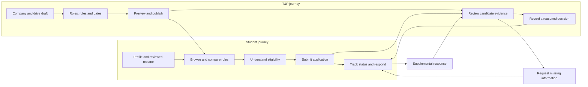
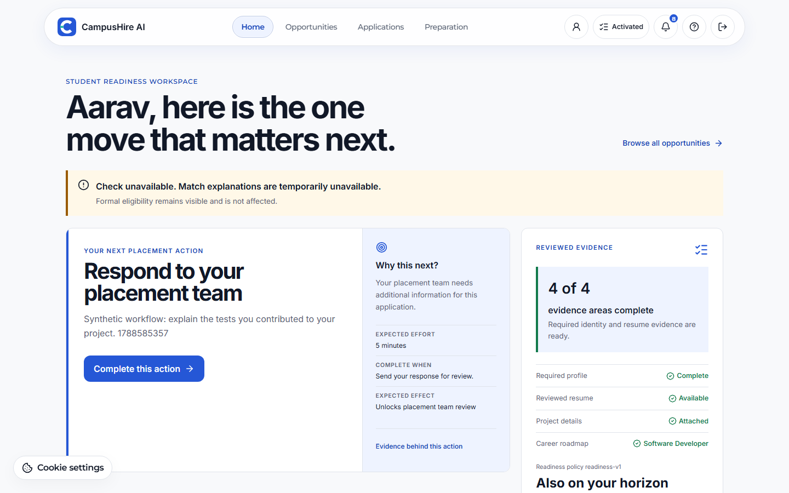
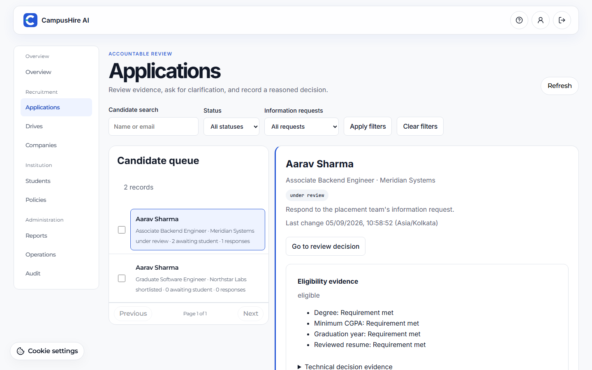
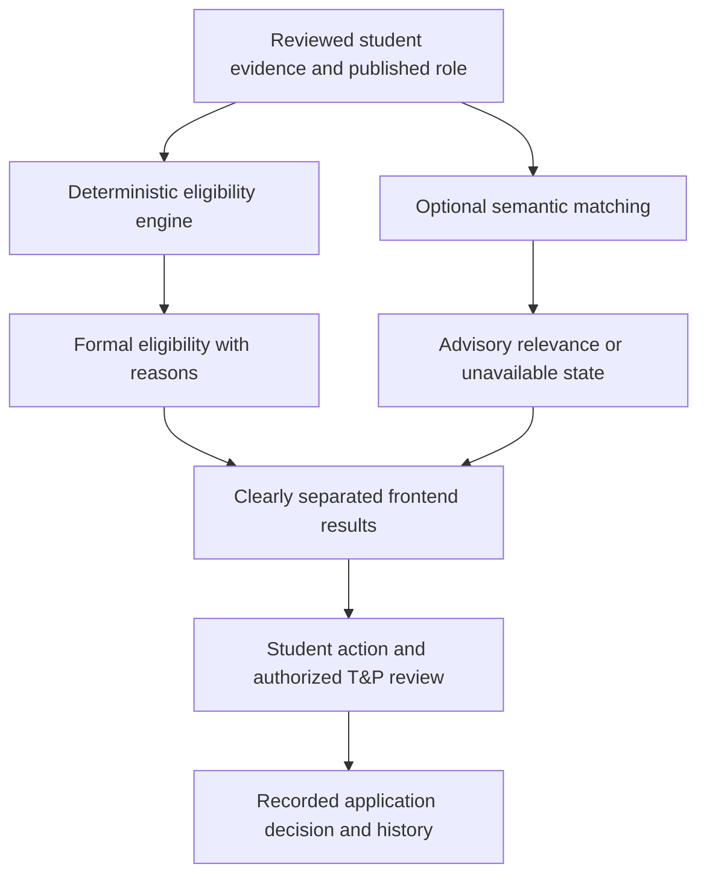
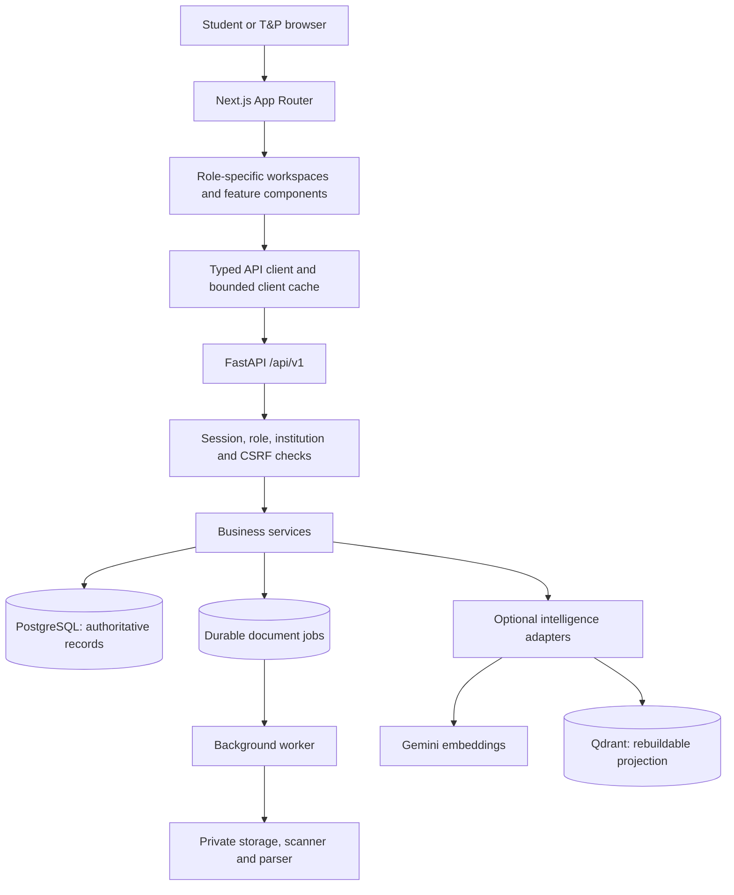

<p align="center">
  
</p>

<h1 align="center">CampusHire AI</h1>

<p align="center">
  A clearer path from student preparation to accountable campus recruitment.<br />
  <strong>Student experience · T&amp;P operations · Reviewed intelligence</strong>
</p>

<p align="center">
  <a href="#the-product">Product</a> ·
  <a href="#ai-with-clear-boundaries">AI approach</a> ·
  <a href="#system-architecture">Architecture</a> ·
  <a href="#run-locally">Get started</a> ·
  <a href="#documentation-map">Documentation</a>
</p>

---

CampusHire connects student profiles, reviewed resumes, placement opportunities, applications, and career preparation in one institution-scoped workflow. Training and Placement (T&P) teams publish drives, review evidence, request corrections, and record decisions without turning an AI score into a hiring rule.

This repository contains the **Next.js frontend**. The [FastAPI backend](https://github.com/painjanevivek/CampusHire-backend) owns authorization, business rules, persistence, document jobs, and AI integrations.

> **Release boundary:** implemented features and local synthetic evidence are not production approval. Read the backend's [authoritative release status](https://github.com/painjanevivek/CampusHire-backend/blob/main/docs/CURRENT_RELEASE_STATUS.md) before any real-student-data deployment. Historical reports qualify only their recorded source versions.

## The product

| Experience | What people can do | Why it matters |
| --- | --- | --- |
| Student workspace | Complete a profile, upload a private profile photo, review resume extraction and wording suggestions, and follow a primary next action | Makes the next useful step visible without hiding prerequisites |
| Opportunity discovery | Browse and save roles, keep named filter views, compare two or three opportunities, and inspect eligibility separately from semantic relevance | Helps students understand a role before applying |
| Application tracking | View recorded status history, respond to information requests, and inspect submission evidence | Explains who needs to act without inventing employer activity |
| Preparation | Explore resume and roadmap tools and role-specific evidence gaps | Connects preparation to reviewed sources and approved mappings |
| T&P workspace | Manage companies and drives, review candidates, request clarification, preview bulk actions, and inspect reports and audit records | Supports repeatable decisions with retained evidence |
| Account and support | Open notifications, use Profile / Settings / Sign out, and find Help and policy links in the footer | Keeps navigation compact, including on mobile |

### Two connected journeys



Correction responses supplement the original application; they do not overwrite its submitted profile, resume, eligibility, or policy snapshots. Marking a notification read does not complete the underlying task.

### Product previews

These checked-in captures show **synthetic demonstration data**, not real students or placement outcomes. They illustrate a recorded implementation increment, not a promise that every later screen is pixel-identical.

<details>
<summary>Student priorities workspace</summary>



</details>

<details>
<summary>T&P application review workspace</summary>



</details>

## AI with clear boundaries

CampusHire is useful for studying **generative AI, retrieval, and bounded agentic orchestration**, but these terms describe different mechanisms. Installing an AI SDK or using LangGraph does not mean every feature is LLM-generated or autonomous.

| Concept | Meaning | Current CampusHire boundary |
| --- | --- | --- |
| Generative AI | A model produces new wording or structured content | The inspected Gemini adapter supplies embeddings, not free-form text generation. Current resume extraction and conservative wording suggestions are rule-based |
| Semantic matching | Compare meaning through vector representations rather than only exact keywords | Backend Gemini embeddings support a separate, versioned relevance result; provider configuration is required |
| Retrieval and grounding | Find approved evidence and show its source | Policy answers retrieve approved text and cite sections/pages; the current answer is assembled from that text, not generated by an LLM |
| Agentic orchestration | Coordinate stateful steps with explicit boundaries | The current LangGraph policy flow is a fixed retrieve → explain graph, not an open-ended planning or tool-selection loop |
| Human-in-the-loop review | Require a person to accept proposals or make decisions | Students review resume changes; authorized T&P users review policy/role proposals and recruitment decisions |
| Deterministic automation | Apply explicit, reproducible rules | Eligibility and dashboard next-action priorities are server-side business logic, not AI opinions |

### What AI must never decide



The advisory branch has no authority to change eligibility. A provider outage may remove a match explanation; it must not silently reject a student or fabricate a replacement score.

### Generative AI extension points — future work

Potential extensions include evidence-grounded resume rewriting and generated policy summaries. Before enabling them, an implementation would need explicit provider calls, output schemas, source attribution, evaluation fixtures, privacy review, bounded time/cost, and human acceptance. Generated achievements, automatic shortlisting, and unreviewed curricula are not acceptable substitutes for evidence.

These are **extension ideas, not shipped capabilities**. See the [backend AI walkthrough](https://github.com/painjanevivek/CampusHire-backend#agentic-ai-and-generative-ai) for the actual graph, provider adapter, and document pipeline.

## System architecture



The browser does not hold provider secrets, directly query the database, or authorize itself by sending an institution ID. Backend OpenAPI is the contract authority; frontend declarations are generated from its reviewed snapshot. Redis supports backend operational concerns, not durable student records.

### Frontend stack and structure

| Layer | Repository choice |
| --- | --- |
| Application | Next.js 16 App Router, React 19, TypeScript |
| UI | Shared layout components, CSS modules and semantic tokens, Lucide icons |
| Typography | Inter for content, Montserrat for controls, JetBrains Mono for technical evidence |
| API contract | Checked OpenAPI snapshot and @hey-api/openapi-ts generation |
| Verification | Vitest, Testing Library, ESLint, TypeScript, browser/accessibility scripts |

Exact versions are maintained in [package.json](package.json) and [package-lock.json](package-lock.json).

```text
src/
├── app/                  Routes, layouts and application entry points
├── components/           Shared controls and workspace shells
├── features/             Student, T&P and public workflows
└── lib/                  API helpers, generated contracts and shared logic
openapi/                  Reviewed backend contract snapshot
public/product-evidence/  Synthetic product screenshots
scripts/                  Contract, browser and performance verification
docs/                     Architecture, delivery and recorded evidence
```

### Interaction principles

- Keep the current task visible; put secondary details behind meaningful disclosure.
- Use compact mobile navigation and account controls, visible focus, and 44px interaction targets.
- Preserve filters and candidate context through supported navigation and refresh flows.
- Render loading, empty, error, unauthorized, and unavailable states explicitly.
- Reserve stronger text emphasis for hierarchy and meaningful state.
- Respect reduced motion and existing cookie controls. Never use browser storage for authentication tokens.

## Run locally

Prerequisites: Node.js compatible with the installed Next.js version, npm, and a configured CampusHire backend. Follow the [backend setup](https://github.com/painjanevivek/CampusHire-backend#run-locally) first for authenticated workflows.

From this repository root, in PowerShell:

```powershell
# Copy only if .env.local does not already exist.
Copy-Item .env.example .env.local
npm ci
npm run dev
```

Open [localhost:3000](http://localhost:3000). Preserve an existing environment file instead of overwriting its settings.

| Variable | Purpose |
| --- | --- |
| NEXT_PUBLIC_API_URL | Browser-accessible API base, including /api/v1; public configuration, never a secret |
| INTERNAL_API_URL | Server-side API base; point it at the same intended CampusHire backend |
| DEMO_LOGIN_ENABLED | Server-only flag displaying synthetic sign-in buttons; does not enable backend accounts by itself |
| NEXT_PUBLIC_APPLICATION_WIZARD_V1 | Optional application-wizard UI flag; coordinate with the backend flag |

For an alternative local port pair:

```dotenv
NEXT_PUBLIC_API_URL=http://127.0.0.1:8001/api/v1
INTERNAL_API_URL=http://127.0.0.1:8001/api/v1
```

```powershell
npm run dev -- --hostname 127.0.0.1 --port 3002
```

Configure the backend to allow exactly http://127.0.0.1:3002. Do not mix localhost and 127.0.0.1 casually: they are different hosts for origin/cookie handling. Never point this frontend at another project's API.

### Synthetic sign-in

Enable DEMO_LOGIN_ENABLED=true locally in both repositories and follow the backend's [synthetic account instructions](https://github.com/painjanevivek/CampusHire-backend#synthetic-demo-accounts). The backend selects credentials server-side and refuses demo sign-in outside development/test. No real passwords belong in the README, browser bundle, or Git history.

## Verification and API compatibility

```powershell
npm run typecheck
npm run lint
npm run test
npm run build
npm run api:check
```

`npm run api:generate` regenerates declarations. `npm run api:check` also checks their Git diff, so an intentional uncommitted contract update can fail that gate until reviewed and committed.

Browser checks require the local services, Python/browser dependencies, and seeded synthetic accounts for authenticated cases:

```powershell
npm run test:accessibility
npm run test:accessibility:authenticated
npm run test:performance
```

Read the scripts' options and evidence documents for origin, fixture, and output configuration. These commands are a reproduction guide, not a statement that they ran against your current checkout. Laboratory navigation targets and small synthetic fixtures are not a 1,000-concurrent-user guarantee.

## Deployment and release boundaries

The [Vercel deployment runbook](docs/VERCEL_DEPLOYMENT.md) describes the frontend project and API environment settings. Keep demo authentication disabled in production. Deploying the frontend alone does not deploy the backend worker, database, malware scanner, or parser infrastructure.

Use compatible backend changes before their frontend consumers. Never carry forward an old security scan, accessibility report, or external approval as evidence for a newer candidate without the required checks.

## Documentation map

| Start here | Read next |
| --- | --- |
| Product and terminology | [Product scope](docs/PRODUCT_SCOPE.md), [Glossary](docs/GLOSSARY.md) |
| Engineering decisions | [Architecture decisions](docs/ARCHITECTURE_DECISIONS.md), [Navigation and tokens](docs/NAVIGATION_AND_TOKENS.md) |
| Implemented workflows | [Product experience upgrade](docs/PRODUCT_EXPERIENCE_UPGRADE.md), [Implementation inventory](docs/IMPLEMENTATION_INVENTORY.md) |
| Quality and evidence | [Release evidence](docs/RELEASE_EVIDENCE.md), [Browser support](docs/BROWSER_SUPPORT_MATRIX.md), [Profile/navigation evidence](docs/evidence/profile-navigation-20260905.md) |
| Delivery | [Change control](docs/DELIVERY.md), [Deployment](docs/VERCEL_DEPLOYMENT.md), [Rollback](docs/RELEASE_ROLLBACK.md) |
| Contribution and disclosure | [Contributing](CONTRIBUTING.md), [Security policy](SECURITY.md) |

Dated implementation notes are historical records; some describe working trees before later commits. Use their source identifiers and the authoritative release status rather than treating every document as a current approval.

---

**CampusHire's operating principle:** prepare with assistance, understand the evidence, and keep consequential decisions accountable.
